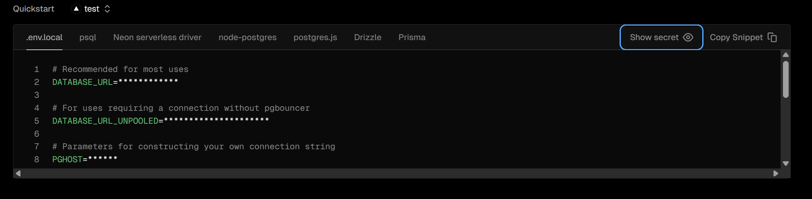

# Hooking Up Postgres To your next project
1. Go to [vercel.com](https://vercel.com)
2. Sign up
3. Click on storage
4. Click create Database
5. Select Neon serverless Postgres
6. Once you have selected the Db you should see the image below.

7. Make sure you are .env.local then click show secret and copy all env variables to .env.local
It should look like this but with actual values not '***'
```env
# Recommended for most uses
DATABASE_URL=************

# For uses requiring a connection without pgbouncer
DATABASE_URL_UNPOOLED=************

# Parameters for constructing your own connection string
PGHOST=************
PGHOST_UNPOOLED=************
PGUSER=default
PGDATABASE=************
PGPASSWORD=************

# Parameters for Vercel Postgres Templates
POSTGRES_URL=postgres:************
POSTGRES_URL_NON_POOLING=************
POSTGRES_USER=default
POSTGRES_HOST=************
POSTGRES_PASSWORD=************
POSTGRES_DATABASE=verceldb
POSTGRES_URL_NO_SSL=************
POSTGRES_PRISMA_URL=************
```
8. Run ``` npm install @neondatabase/serverless ```
9. run npm run dev and go to [localhost:3000](localhost:3000)